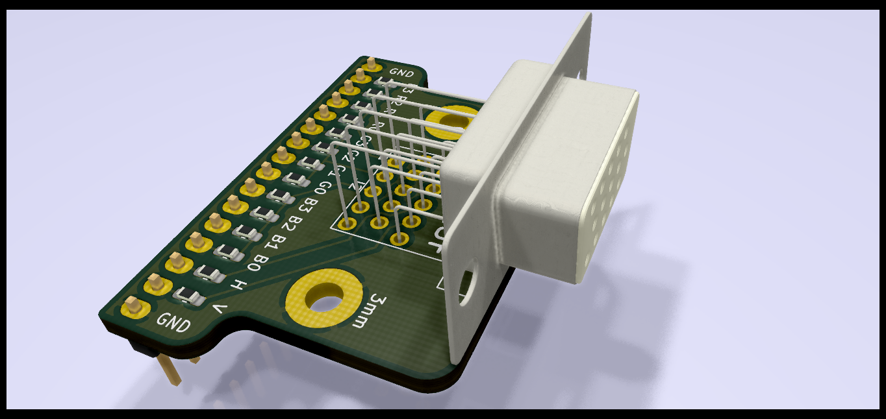
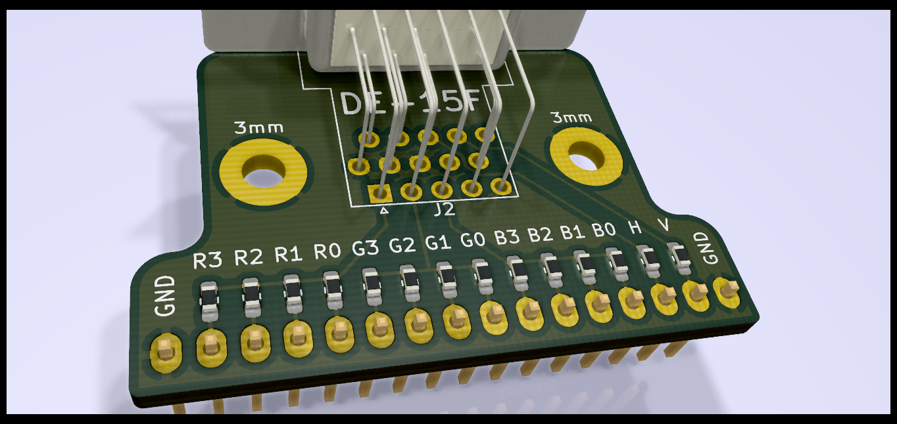
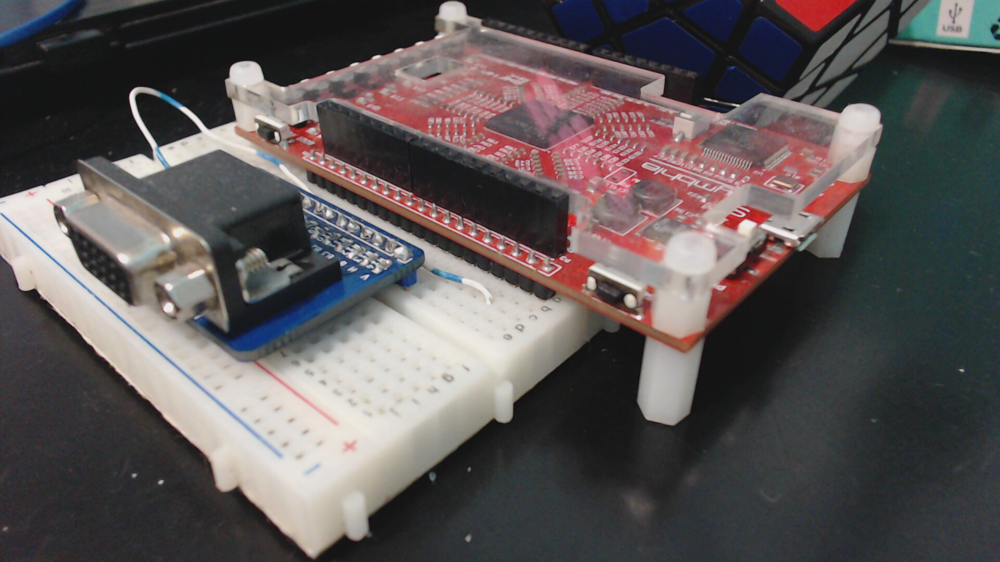

# VGA adapter
This is a simple PCB board for interfacing a FPGA with SIL header to a VGA connector to add video functionalities to your projects.

First render

Second render

Please note that the VGA board showed in the next pictures is an older version and that's the reason there is a cable for connecting ground.
The new version has ground pins on both sides to avoid use cables (generally ground pins are at the begin/end of one SIL header in the development boards).

Perpective view

Top view

## Using the PCB board

